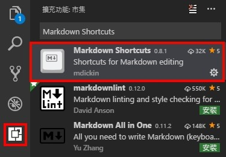
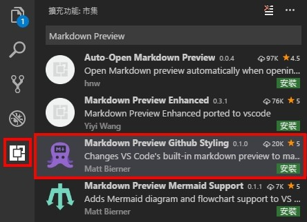
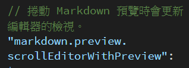

# markdown學習筆記

Markdown是一种可以使用普通文本编辑器编寫的標記語言，它可以使普通文本内容具有一定的格式。 **它本身是不支持修改字體、字号與颜色等功能的，但可用Html寫法來達成**


<font color="blue"><b>install vs code markdown Plug-in</b></font>

**1.安裝 Markdown Shortcuts**


可增加套入markdown的樣式效率,將要套入樣式的字體全選後點快捷鍵即可ex: ctrl+B=粗體

**2.安裝 Markdown Preview Github Styling**



Github 的樣式當底

 <font color="blue">**Ctrl + Shift + V預覽**</font>

 預覽視窗預設會連動編輯視窗跟著滾動,可至Markdown設定檔將

 

**true改為false**

[參考網站] https://ithelp.ithome.com.tw/articles/10190508

連結中有提供程式語法高亮的 CSS

範例如下

```ruby
require 'tabbit'
table = Tabbit.new('Name', 'Email')
table.add_row('Tim Green', 'tiimgreen@gmail.com')
puts table.to_s
```

 ---

#*1=h1 | #*2=h2 | #*3=h3
--- | --- | ---
#*4=h4 | #*5=h5 | #*6=h6

#字號於Git hub上會轉換為錨點連結模式
## 強調語法

1.*test*  | 2.**test** | 3.**_test_** | 4.~~test~~


```
區塊顯示可以``` or tab

1.*test* or_test_ = 斜體 
2.**test**or__test__= 粗體 
3.**_test_**= 粗體+斜體
4.~~test~~ = 刪除線
```


## 清單

* 1 = * 1
+ 1 = + 1
- 1 = - 1

1. =有序號清單


>引言= >+文字

(https://www.google.com "test")

[參考連結] https://www.google.com

```
指定圖片=
```

下方---or***or___為水平線

---


    

套用html格式也可以顯示

<ul>
  <li>Definition list</li>
  <p>Is something people use sometimes.</p>

  <li>Markdown in HTML</li>
  <p>Does <b>not work very well.</b> Use HTML <em>tags</em>.</p>
</ul>


## 圖片超連結至影片二種方式

```
1.
<a href="https://youtu.be/zHPqO0UnaW8" target="_blank">
</a>

```
<a href="https://youtu.be/zHPqO0UnaW8" target="_blank">

</a>

```
2.
[](https://youtu.be/zHPqO0UnaW8)


```

[](https://youtu.be/zHPqO0UnaW8)


