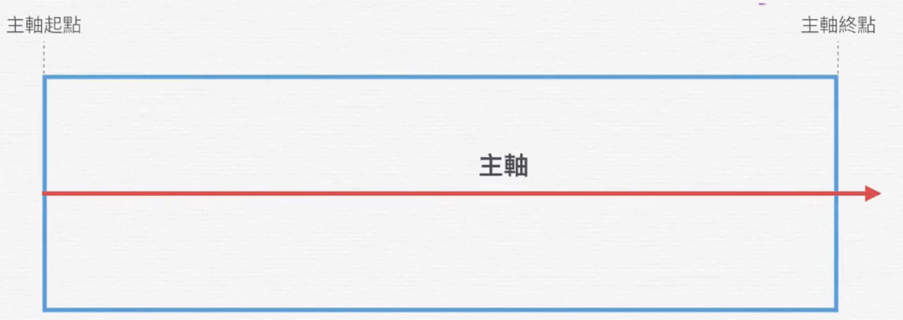
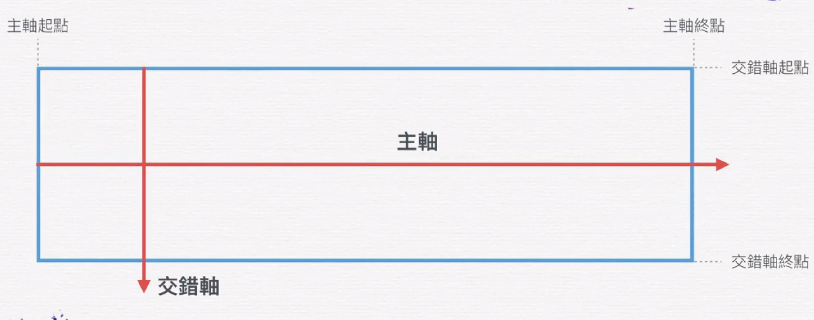

# flexbox 學習

Flexbox 是一個 CSS3 的盒子模型 ( box model )，顧名思義它就是一個靈活的盒子 ( Flexible Box ),Flexbox 的盒子模型具有水平的起點與終點 ( main start、main end )，垂直的起點與終點 ( cross start、cross end )，水平軸與垂直軸 ( main axis、cross axis )，這些都是相當重要的布局規畫,flex不像傳統的float只能水平的排列,它還可以做垂直的排列。

### 1.flex的軸線觀念 
flex軸線物件排列方式是由左至右的



垂直於主軸的是交錯軸



### 2.flex-direction
flex items 會隨著主軸依序排列,而主軸會隨著flex-direction的屬性來決定方向

用法：

```java
#container {
    flex-direction: row | row-reverse | column | column-reverse;
}

```

<font color="blue"> <b>row：由左到右排列</b></font>


<font color="blue"> <b>row-reverse：由右至左排列</b></font>


<font color="blue"> <b>column：由上而下</b></font>


<font color="blue"> <b>column：由下而上</b></font>


3.


