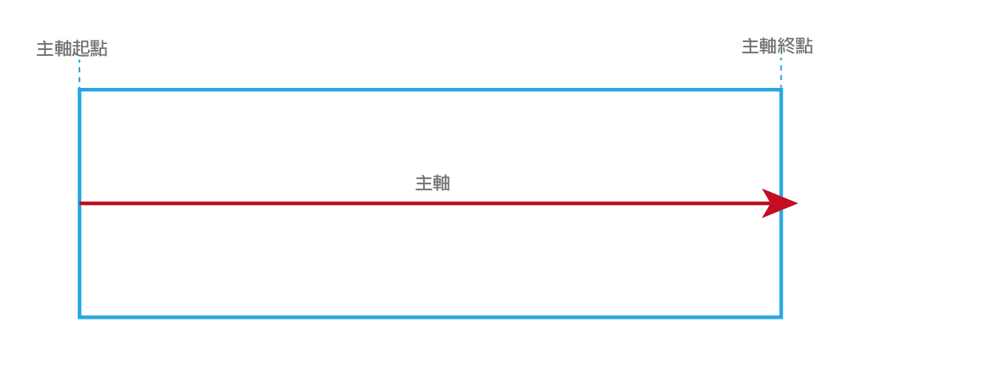

# flexbox 學習 

Flexbox 是一個 CSS3 的盒子模型 ( box model )，顧名思義它就是一個靈活的盒子 ( Flexible Box ),Flexbox 的盒子模型具有水平的起點與終點 ( main start、main end )，垂直的起點與終點 ( cross start、cross end )，水平軸與垂直軸 ( main axis、cross axis )，這些都是相當重要的布局規畫,flex不像傳統的float只能水平的排列,它還可以做垂直的排列。

<h5 id="16">begin ' v  '</h5>

* [Flex Container 屬性介紹](#1)

    + [display](#2)

    + [flex的軸線觀念](#3)

     + [flex-direction](#4)

     + [justify-content](#5)

     + [align-items](#6)

     + [align-self](#7)

     + [flex-wrap](#8)

     + [align-content](#9)

*  [Flex item 屬性介紹](#10)

    + [order](#11)

    + [flex-basis](#12)

    + [flex-grow(伸展)](#13)

    + [flex-shrink(內縮)](#14)

*   [關於flexbox的補充說明](#15)


   

<h2 id="1"><font color="#ff9933">Flex Container 屬性介紹</font></h2>

<h3 id="2">1. display </h3>
用法:


```java
#container  {
    display: flex | inline-flex ;
}
```
用來將容器定義為 flex container，flex 等同於 block 
inline-flex 等同於 inline-block

使用inline-flex要注意以下幾點

* 多欄模組的所有 ‘column-*’ 屬性在伸縮容器上沒有作用。
* ‘float’ 與 ‘clear’ 在伸縮項目上沒有作用。
* ‘vertical-align’ 在伸縮項目上沒有作用。


<h3 id="3"> 2. flex的軸線觀念 </h3>

flex軸線元件排列方式是由左至右的



垂直於主軸的是交錯軸


<h3 id="4"> 3. flex-direction </h3>

flex items 會隨著主軸依序排列,而主軸會隨著flex-direction的屬性來決定方向

用法：

```java
    flex-direction: row | row-reverse | column | column-reverse;

```

<font color="blue"> <b>row：由左到右排列(為默認值)</b></font>


<font color="blue"> <b>row-reverse：由右至左排列</b></font>


<font color="blue"> <b>column：由上而下</b></font>


<font color="blue"> <b>column-reverse：由下而上</b></font>


<h3 id="5"> 4. justify-content </h3>

justify-content會依據主軸的軸線,決定子元件之間的間隔方法

用法:

```java
justify-content: flex-start | flex-end | center | space-between | space-around
```
<font color="blue"> <b>flex-start:靠齊主軸的起點</b></font>


<font color="blue"> <b>flex-end:靠齊主軸的終點</b></font>


<font color="blue"> <b>center:對齊於主軸的起點與終點之間</b></font>


<font color="blue"> <b>space-between:將第一個元件貼齊起點,最後一個元件貼齊終點,平均分配每一個元件空間</b></font>


<font color="blue"> <b>space-around:平均每一個子元件平均分配空間</b></font>


<h3 id="6"> 5. align-items </h3>

align-items為交錯軸的對齊方式

用法:

```java
align-items:flex-start | flex-end | center | baseline | stretch

```
<font color="blue"> <b>flex-start:所有的元件都會貼齊交錯軸的起點</b></font>


<font color="blue"> <b>flex-start:所有的元件都會貼齊交錯軸的終點</b></font>


<font color="blue"> <b>center:元件會在交錯軸的起點和終點之間</b></font>


<font color="blue"> <b>baseline:元件會從文字的基準線開始作排列</b></font>


<font color="blue"> <b>stretch:將所有的元件從交錯軸的起點拉滿至交錯軸的終點(在寬度以%數為單位下使用，且高度被限制的情況下不會伸展)</b></font>


<h3 id="7"> 6. align-self</h3>
與align-irems的值一樣,但它是針對自己的屬性的對齊方式

用法:

```java
align-self:flex-start | flex-end | center | baseline | stretch
```
<font color="blue"> <b>flex-start:元件貼齊交錯軸的起點</b></font>


<font color="blue"> <b>flex-start:元件會貼齊交錯軸的終點</b></font>


<font color="blue"> <b>center:元件會在交錯軸的起點和終點之間</b></font>


<font color="blue"> <b>baseline:元件會從文字的基準線開始作排列</b></font>


<font color="blue"> <b>stretch:元件從交錯軸的起點拉滿至交錯軸的終點(在寬度以%數為單位下使用，且高度被限制的情況下不會伸展)</b></font>


<h3 id="8"> 7. flex-wrap (此範例有給margin上下左右值)</h3>
定義子元件在寬度不夠伸縮框架時的換行屬性設定

用法:
```java
flex-wrap: wrap | nowrap | wrap-reverse
```

flex-wrap可以跟flex-ditection做結合

用法:

```java
flex-flow:row wrap | row-reverse  wrap | column wrap | column-reverse wrap | row wrap-reverse | row-reverse wrap-reverse  | column wrap-reverse | column-reverse wrap-reverse
```

<font color="blue"> <b>wrap:有換行</b></font>


<font color="blue"> <b>nowrap:無換行</b></font>


<font color="blue"> <b>wrao-reverse:有換行並且順序相反,注意順序排列的方向</b></font>


<h3 id="9"> 8. align-content (此範例有給margin上下左右值)</h3>

在設定wrap的屬性下才可以作用,它是全體組件下的對齊,屬性與justify-content一致,但須配合justify-content:center才能達到至中

用法:

```java
align-content: flex-start | flex-end | center | space-between | space-around | stretch
```


<font color="blue"> <b>flex-start:靠齊主軸的起點</b></font>


<font color="blue"> <b>flex-end:靠齊主軸的終點</b></font>


<font color="blue"> <b>center:對齊於主軸的起點與終點之間</b></font>


<font color="blue"> <b>space-between:第一組件貼齊起點,最後一組貼齊終點</b></font>


<font color="blue"> <b>space-around:組件平均分配上下的空間</b></font>


<font color="blue"> <b>stretch:組件從交錯軸的起點拉滿至交錯軸的終點(在寬度以%數為單位下使用，且高度被限制的情況下不會伸展)</b></font>


<h2 id="10"> <font color="#ff9933">Flex Item 屬性介紹</font></h2>
<h3 id="11"> 1. order</h3>

order 這個屬性可以直接指定一個數字，就可以由小到大排列順序，值越小的排越前面

用法:

```java
//html
        <div class="item order2">1</div>
        <div class="item order1">2</div>
        <div class="item order3">3</div>
        <div class="item order5">4</div>
        <div class="item order4">5</div>
        <div class="item order6">6</div>
//css
    .item {
    width: 50px;
    height: 50px;
    background-color: red;
    margin: 2px;
}

.order1 {
    order: 1;
}

.order2 {
    order: 2;
}

.order3 {
    order: 3;
}

.order4 {
    order: 4;
}

.order5 {
    order: 5;
}
```


<h3 id="12"> 2. flex-basis(會結合flex-grow 或 Flex-shrink 的值來伸縮)</h3>

此屬性會依照 flex-direction 定義 item 最小的寬度或高度，有點類似 min-width。但是寬度或高度不能小於 X px 或 em。(範例見第4項)

<h3 id="13"> 3. flex-grow(伸展)</h3>
此屬性賦予每個 item 在需要時自動佔滿剩餘寬度的能力。值為一個無單位的數字，此數字決定了 item 在剩餘的空間內該佔滿多少比例的寬度。如果所有的 item 都將 flex-grow 設為 1，那麼每個 item 都會有相同寬度並佔滿所有空間。如果將其中一個的 flex-grow 改為 2 的話，被修改的元素將會佔滿比其他元件兩倍大的空間，如果設置為 0 則不會縮放

用法:

```java
//html
<div class="wrap">
        <div class="item item1">1</div>
        <div class="item item2">2</div>
</div>

//css
.wrap{
    display:inline-flex;
    height:60px;
    width:300px;
}
.item{
    height:60px;
    text-align: center;
    color:#fff;
    line-height: 60px;
}
.item1{
    flex-grow:1;//default 0 
    background:#c00;
}
.item2{
    flex-grow:2;//default 0 數值愈大占的空間也愈大
    background:#000;
}
```


<h3 id="14"> 4. flex-shrink(內縮)</h3>

此屬性賦予每個 item 在需要時內縮寬度的能力。值為一個無單位的數字，此數字決定了 item 在空間分配還不足時內縮多少比例的寬度。flex-shrink會依照flex-basis的值來內縮，如果設置為 0 則不會縮放

用法:

```java
//html
<div class="wrap">
        <div class="item item1">1</div>
        <div class="item item2">2</div>
</div>

//css
.wrap{
    display:inline-flex;
    height:60px;
    width:300px;
}
.item{
  
    flex-basis: 200px;////default auto
    height:60px;
    text-align: center;
    color:#fff;
    line-height: 60px;
}
.item1{
    flex-shrink: 9;//default 1 數值愈大占的空間愈小
    background:#c00;
}
.item2{
    flex-shrink: 2;//default 1
    background:#000;
}
```


5.flex

flex 屬性是 flex-grow，flex-shrink 和 flex-basis 的縮寫，第二和第三個參數 (flex-shrink 和 flex-basis) 可不給。預設值為 0 1 auto。如果只設定一個則是 flex-grow

用法：

```java
flex: 2 1 200px;//值依序為flex-grow　＆　flex-shrink　＆　flex-basis　

flex: 1;//flex-grow
```

<h2 id="15"><font color="#ff9933">關於flexbox的補充說明</font></h2>

* margin 和 padding 不要使用 % 。

* 即使 position: static，z-index 也會有效。

* justify-content在 row情況下 flex-start 會在左方,flex-end會在右方(reverse則相反) 。

  + align-items在 row情況下 flex-start 會在上方,flex-end會在下方(reverse則相反) 。

* align-items在 column情況下 flex-start 會在左方,flex-end會在右方(reverse則相反) 。
  + justify-content在 column情況下 flex-start 會在上方,flex-end會在下方(reverse則相反) 。

* 當flex以"row"為方向時，justify-content控制橫向對齊，align-items控制縱向對齊 。

* 當flex以"column"為方向時，justify-content控制縱向對齊，align-items控制橫向對齊 。

**以下為參考連結**

[跟著小青蛙學flexbox]http://flexboxfroggy.com/#zh-tw

[flexbox版面配置]https://rhadow.github.io/2015/02/26/learnFlexbox/

[flexbox要注意的細節]
https://hk.saowen.com/a/3d8cc3f97f0703420d7fcdd938e083eed570ac371e63468e458c60f40dea29c8


 [top](#16)