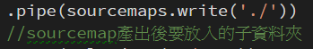

# 引入gulp sourcemap流程 

## step1 npm install source-map
---
## step2 將這段引入至gulpfile.js


  
 ## step3 引入這三段


將上續三段放至進 *return gulp.src('./scss/**/*.scss')中

如下圖所示


若gulp編譯後衛產出sourcemap請檢查是否有以下這兩段

```java

.pipe(sourcemaps.init())//產出前的呼叫
.pipe(sourcemaps.write('./debug'))//())最後方括弧為必填值,不然系統無法產出

```

**若無須放入子資料夾以根目錄表示法**



## step3

 compile後會產生.map的檔案在相對應的資料夾

**於compile的.css中最後一行會出現以下(不是.map)** 
```java
/*# sourceMappingURL=debug/Parallax-scrolling.css.map */
```


<h3><font color="blue">
如何於本機瀏覽狀態來編輯scss存檔後同步至vs code</font></h3>

 * 開啟專案瀏覽狀態->開發者工具->開啟source->於Preference勾選以下設定


* 於workspace Add 自己的專案->於More options開啟專案檢視全部資料夾


* 找到要修改的scss檔案做修改後存檔,於vs code就會同步更新.

 
