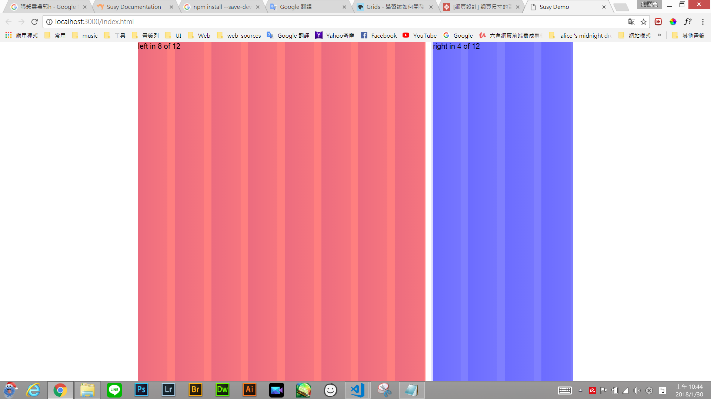

# susy 學習筆記 

<font color='blue'><b>susy install</b></font>

## Step1.安裝以下
* node.js  (gulp 為 Node.js 的套件，所以安裝 gulp 前請先安裝 Node.js)
* npm install --save gulp
* npm install --save gulp-sass
* npm install
* npm install --save node-sass
* npm install susy
* npm install normalize.css(它是優於傳統的css reset)

[normalize.css介紹]  http://jerryzou.com/posts/aboutNormalizeCss/

## step2 複製貼上以下code至gulpfile.js


```javascript
const gulp = require("gulp");
const sass = require("gulp-sass");
const autoprefixer = require("gulp-autoprefixer");
const sourcemaps = require("gulp-sourcemaps");
const browserSync = require("browser-sync").create(); //瀏覽器同步檢視
const reload = browserSync.reload;

// Compiles sass into css
gulp.task("sass", () => {
  return gulp
    .src("./scss/**/*.scss")
    .pipe(sourcemaps.init())
    .pipe(
      sass({
        includePaths: ["./bower_components", "./node_modules"]
      }).on("error", sass.logError)
    )
    .pipe(autoprefixer())
    .pipe(sourcemaps.write('./debug'))
    .pipe(gulp.dest("./css"))
    .pipe(browserSync.reload({
      stream: true
    }));
});


gulp.task('browser-sync', function () { // 建立本機伺服器,gulp.task後方的任務名稱要與最下方的gulp.task一致才可以輸出(注意大小寫)
  browserSync.init({
    server: {
      baseDir: './'
    },
    startPath: "index.html",//要瀏覽的分頁
    reloadDebounce: 2000
  })
});

gulp.task("watch", ["sass"], () => {
  gulp.watch("**/*.html", browserSync.reload);
  gulp.watch("**/*.scss", ["sass"]);
});

gulp.task("default", ["watch", "browser-sync"]);
});
```
## step3.開始編譯前要@import以下至.scss檔

@import這段至susy setting檔(setting檔為_引入檔不編譯出來,副檔名為.scss)
```java
// un-prefixed functions
@import 'node_modules/susy/sass/susy';
```
@import這段至要輸出檔(副檔名為.scss)
```java
// Normalize css
@import "normalize-css/normalize";
//susy setting
@import "_grids.scss";//為引入檔,檔名可改
// Start code
```

## step4 compile scss output grids
```java
.wrap {
  @include container(940px 12);//94px網頁尺寸的黃金比例,12能被3、4、6整除,使用上較為靈活
  height: 100vh;
  .left {
    @include span(8 of 12);//12攔中占8欄
    background: rgba(red, 0.7);
    height: 100%;
  }
  .right {
    @include span(4 of 12 last);//12欄中占4欄
    background: rgba(blue, 0.7);
    height: 100%;
  }
}
```
## step5 於command line中輸入 gulp即可預覽畫面

成功會顯示這畫面




[參考網站 susy官網]http://oddbird.net/susy/docs/

[參考網站 960grid system]https://www.cadiis.com.tw/lessons-learned/507-web-page-size-960-grid-system


