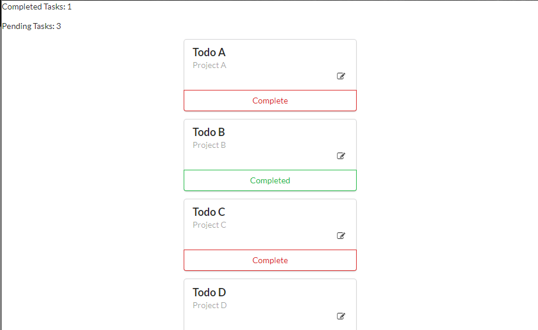

# Vue-cli todoList
>## [教學範例](https://scotch.io/tutorials/build-a-to-do-app-with-vue-js-2)


按先前 [Vue-cli 建置教學](https://github.com/MonospaceTW/goodfood/blob/Ryin/docs/R-yin/vue-cli_creat/vue-cli_creat.md) 中步驟架設好專案後

先至 ```index.html``` 中撰寫以下 code ，載入這些框架 ( semantic 、 sweetalert ) 
```html
<script src="https://cdnjs.cloudflare.com/ajax/libs/jquery/3.2.1/jquery.min.js"></script> 
<link rel="stylesheet" type="text/css" href="https://cdnjs.cloudflare.com/ajax/libs/semantic-ui/2.2.7/semantic.min.css">
<script src="https://cdnjs.cloudflare.com/ajax/libs/semantic-ui/2.2.7/semantic.min.js"></script>
<link rel="stylesheet" type="text/css" href="https://cdnjs.cloudflare.com/ajax/libs/sweetalert/1.1.3/sweetalert.min.css">
<script src="https://cdnjs.cloudflare.com/ajax/libs/sweetalert/1.1.3/sweetalert.min.js"></script>
```

## Step 1. [開始組件化囉！ (Component structure)](https://scotch.io/tutorials/build-a-to-do-app-with-vue-js-2#toc-component-structure)

### 1-1. 創建一個我們自己的組件 ( Creating a Component )
我們現在要來建立我們自己需要的組件

在建置專案的時候，預設會產生一支 ```HelloWorld.vue``` (位於 src/components/Hello.vue. )

但我們現在要來寫自己的組件，所以就不需要這支檔案了

我們先創建一支 ```TodoList.vue``` 檔案，code 如下

```JS
<template>
  <div>
    <ul>
        <li> Todo A </li> 
        <li> Todo B </li> 
        <li> Todo C </li> 
    </ul> 
  </div>
</template>

<script type = "text/javascript" >

export default {
};
</script>
<style>
</style>
```

### 1-x. 補充：組件化的定義

教學原文
> A component file consists three parts; template, component class and styles sections. The template area is the visual part of a component. Behaviour, events and data storage for the template are handled by the class. The style section serves to further improve the appearance of the template.


我的理解是
> 一份組件化的檔案( component file )分為三個部分，模板( template，即 HTML 部份)、組件( component class ，即 JavaScript 部份) 及 樣式( styles sections ，即 CSS 部份)。


### 1-2. 引入組件 ( Importing Components )
在剛剛我們創了我們自己的 ```TodoList.vue``` 組件檔

現在我們要將它引入 main component ( ```App.vue``` ) 中

詳細操作可參考 ```App.vue``` 內的註解(下圖)


再來為了渲染組件，我們必須修改 ```App.vue``` 當中 ```<template>``` 的內容，像是 HTML 元素一樣調用它

**HTML 中的 Component 不可使用駝峰式命名，而必須使用 - 或 _ 等方式**

**但若寫在 ```<template></template>``` 中的話則無此限制，但仍建議遵循此規範**

更詳盡的命名規範可參考 [聊聊 Vue 组件命名那些事](https://jingsam.github.io/2016/10/30/vue-components-naming.html)


接著我們把預設的 style 樣式也註解掉

### 1-3. 檢視成果
再經歷以上修改過後的 ```App.vue``` 會長這樣(下圖)


此時我們再使用 ```npm run dev``` (或輸入 http://localhost:8080 )來看看目前的成果吧！


若畫面跟上圖一樣的話，恭喜，截止目前為止的步驟都對囉！


## Step 2. [添加組件內容 ( Adding Component Data )](https://scotch.io/tutorials/build-a-to-do-app-with-vue-js-2#toc-adding-component-data)

教學原文
> We will need to supply data to the main component that will be used to display the list of todos. Our todos will have three properties; The title, project and done(to indicate if the todo is complete or not). Components avail data to their respective templates using a data function. This function returns an object with the properties intended for the template. Let's add some data to our component.

我的理解是
> 我們需要提供一些資料(組件)內容到 Todo 的主要組件 ( main component )內。預期的 TodoList 有三個主要屬性，分別是 標題，詳細內容 及 是否完成。
每個組件各有一個函式，用來返還"數據資料值 ( object )"給各自的模版( template )。

### 2-1. 增加組件( cimponent )內的內容屬性
我們修改 ```App.vue``` 中的內容，增加以下 code
```JS
data() {
    return {
      todos: [{
        title: 'Todo A',
        project: 'Project A',
        done: false,
      }, {
        title: 'Todo B',
        project: 'Project B',
        done: true,
      }, {
        title: 'Todo C',
        project: 'Project C',
        done: false,
      }, {
        title: 'Todo D',
        project: 'Project D',
        done: false,
      }],
    };
  },
```
完整如下圖


### 2-2. 使用 ```v-bind``` 進行綁定

> 關於 ```v-bind``` 更詳細的介紹，參考[官方文件](https://v1-cn.vuejs.org/guide/class-and-style.html)

因為我們需要將資料從主組件 ( main component )傳到 TodoList 組件( TodoList component )

所以我們使用 ```v-bind``` 這樣一個綁定指令。

在 ```App.vue``` 中修改 code 如下
```JS
<todo-list v-bind:todos="todos"></todo-list>
```

這麼做是為了讓元素的 **todos(參數**) 跟 **data function 中的 todos** 的值做綁定 ( element’s todos attribute to the value of the expression todos. )

也就是子組件綁定父組件

↑ 打個問號，需要再做消化理解


現在我們要將 **參數 todos**  使用 ```props``` 來做數據傳遞

在 ```TodoList.vue``` 中加入以下 code

```JS
export default {  
    props: ['todos'],
}
``` 

這樣一來當我們在操作這份 ToDoList 的時候，其實就是在 ```TodoList.vue``` 組件( component )中操作 ```App.vue``` 裡面的 data

↑ 打個問號，回頭再消化自己理解是否正確

> ### 關於 Vue prop
> 在 Vue 中，父子組件的關係可以總結為 prop 向下傳遞，事件向上傳遞。父組件通過 prop 給子組件下發數據，子組件通過事件給父組件發送消息。看看它們是怎麼工作的。（下圖）
> 
> 

> 參考資料： [Vue 官方文件 ：动态 Prop](https://cn.vuejs.org/v2/guide/components.html#%E5%8A%A8%E6%80%81-Prop)

## Step 3. [畫面、數據渲染 ( Looping and Rendering Data )](https://scotch.io/tutorials/build-a-to-do-app-with-vue-js-2#toc-looping-and-rendering-data)

### 3-1. 使用 ```v-for``` 將 ToDos 渲染到畫面上
這邊我們使用一個 for 迴圈來將資料中的 ToDos 渲染到畫面上
> 補充資料： [官方文件 - 列表渲染](https://cn.vuejs.org/v2/guide/list.html)

我們將修改 ```TodoList.vue``` 的內容，詳細如下
```js
<<template>
  <div>
    <!-- 在 Vue 中， JavaScript 的表達式必須用雙括號包起來(double curly brackets ) -->
    <p>Completed Tasks: {{todos.filter(todo => {return todo.done === true}).length}}</p>
    <p>Pending Tasks: {{todos.filter(todo => {return todo.done === false}).length}}</p>
    <!-- 使用 v-for 來做畫面渲染 -->
    <div class='ui centered card' v-for="todo in todos">
      <div class='content'>
        <div class='header'>
          {{ todo.title }}
        </div>
        <div class='meta'>
          {{ todo.project }}
        </div>
        <div class='extra content'>
          <span class='right floated edit icon'>
            <i class='edit icon'></i>
          </span>
        </div>
      </div>
      <div class='ui bottom attached green basic button' v-show="todo.done">
        Completed
      </div>
      <div class='ui bottom attached red basic button' v-show="!todo.done">
        Complete
      </div>
    <!-- 若是參考教學的部份要注意，它的範例 code 中漏了這邊的 </div> -->
    </div>
  </div>
</template>

<script type = "text/javascript" >
// 這部份在前段已新增
export default {
  props: ['todos'],
};
</script>

<script type = "text/javascript" >
// 這部份在前段已新增
export default {
  props: ['todos'],
};
</script>
```

截至目前為止，我們的畫面應該會是這樣


