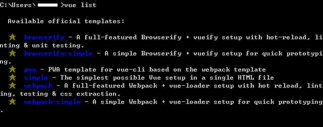
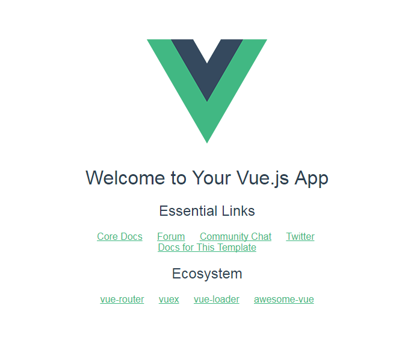

# vue-cli 環境建立

- ## Video
    - [Vue.js 教學 - Vue CLI 示範教學](https://www.youtube.com/watch?v=3ypel9_VtmU)
    - [[線上讀書會] 介源 主講 vue cli 入門與應用](https://www.youtube.com/watch?v=QNIEPHfoZK8)
- ## Blog
    - [Vue-cli 基礎入門 - 2018](https://www.gitbook.com/book/qq7886/vue-cli-2018/details)
    - [[Vue] 跟著 Vue 闖蕩前端世界 - 02 使用 Vue-cli 建構專案](https://dotblogs.com.tw/wasichris/2017/03/01/172049)

## VSCode 安裝 [vetur](https://marketplace.visualstudio.com/items?itemName=octref.vetur) 套件
[Vetur：VSCode下强大的Vue开发工具](https://zhuanlan.zhihu.com/p/27561649)
　
　

---

　
　
# 自己的筆記自己做

## Step 1.  安裝 [Node.js](https://nodejs.org/en/) 
vue-cli 官方**建議安裝 v.6.x 版本以上**的 Node.js

再安裝完 Node.js 後，我們可以使用以下指令來**檢查版本**

(Node.js 在 0.6.3 版本開始內建 npm)
```
node -v
```
```
npm -v
```
若皆有正確，會顯示如下 (白圈範圍為 User Name)


更多關於 npm 的詳細介紹，請參照 [nodejs-wiki-book](https://github.com/nodejs-tw/nodejs-wiki-book/blob/master/zh-tw/node_npm.rst)

## Step 2. **「全域」**安裝 vue-cli
```
npm install vue-cli -g
```
npm 安裝當中的 -g 是 global(全域) 的意思

使用全域安裝 vue-cli 是為了讓指令可以直接在系統上執行，而不是僅在各個專案中運行(區域安裝)

我們可以嘗試運做底下 command-line 指令

- 查看指令
```
vue
```
- 查看版本( V 需大寫)
```
vue -V
```

## Step 3. 建立專案
### 3-1. 初始化一個專案
我們可以先用以下指令來了解 Vue 官方的 template 有哪些 
```
vue list
```



可以看到官方提供了6種方法，更詳細的內容可以到 [官方 Github文件](https://github.com/vuejs/vue-cli#official-templates) 了解

在這邊我們先使用 webpack樣版 來建立一個專案，名稱為 first-vue
指令如下
```
vue init webpack first-vue
```

### 3-2. 專案環境設定
在我們建立(初始化)一個專案後，系統會要求我們填寫一些專案基本資料
- ```Project name```：專案名稱
- ```Project description```：專案概述
- ```Vue build```：Runtime + Compiler 及 Runtime-only 兩種
- ```nstall vue-router```：是否安裝 vue-router
- ```Use ESLint to lint your code```：是否使用 ESLint 來規範程式碼
- ```Pick an ESLint preset```：Standard、Airbnb 及 none 三種
- ```Set up unit tests```：是否加入單元測試
- ```Setup e2e tests with Nightwatch```：是否加入 e2e 測試
- ```Should we run `npm install` for you after the project has been created```：完成後是否自動執行 npm install

其中比較要注意的像是**使用 ESLint 規範 Project**

倘若有使用此項且在撰寫過程中 ESLint 有報錯，請一定要即時修正，否則系統會不幫你繼續進行後續編譯

當然也可以一路 Enter 到底，使用系統幫你預填的內容，就可以開始安裝了

更詳細的內容可以參考 [Vue Cli 介紹](https://paper.dropbox.com/doc/Vue-Cli-pbpJGPUyjZy5xuoSFffId)
　
　
　
### 3-3. 安裝專案環境套件
首先我們先使用 ```cd``` 移動至專案環境內
```
cd first-vue
```
倘若在前面已選擇自動安裝，則可忽略下列步驟
```
npm install
```

再安裝完成後會發現專案資料夾好像多了許多檔案也變胖了不少!?

這個我們之後再來了解即可

在這邊我們只需要先知道 ```npm install``` 其實是根據專案內的 **package.json** 檔案內容來決定要安裝哪些套件

我們早先設定的專案環境內容也可以在這邊修改
　
　
## Step 4. 運行專案
終於可以來跑跑看剛剛那一連串不知道在幹嘛的步驟到底都做了什麼囉！

在確定我們的環境是在 first-vue 裡面後，執行以下 code
```
npm run dev
```
dev 即 develop ，開發環境

在 command-line 跑完後，打開瀏覽器輸入 [http://localhost:8080](http://localhost:8080)

若看到以下畫面



代表上述步驟都沒做錯，已經成功安裝囉！
　
　
## Step 5. 測試檔案

首先移動到檔案所在的路徑
```
vue build [檔案名稱]
```
這邊我們使用 ```vue build App.vue```
待 command-line 運行完後，打開瀏覽器輸入 [http://localhost:4000](http://localhost:4000)

即可測試此支檔案