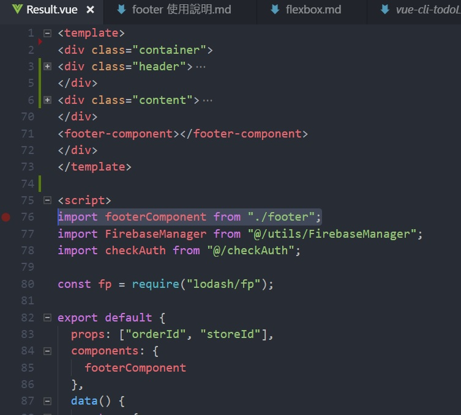
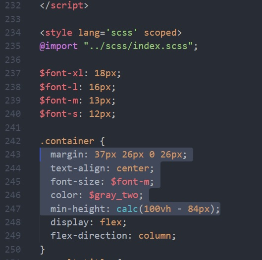

# footer 使用說明

## 以結果頁為例，步驟如下:

### 1.在 template 中增加 `<footer-component></footer-component>`

template 的 HTML 結構如下:

```
<template>
<div class="container">
<div class="header"></div>
<div class="content"></div>
<footer-component></footer-component>  
</div>
</template>
```

如下圖:


### 2.在 script 中增加

```
import footerComponent from "./footer";
```

如下圖:



### 3.在 export dafault 的 components 中加入 footer component

```
  components: {
    footerComponent
  },
```

如下圖:


## 修改 container 的 SCSS

在 style 中的 .container 加入 min-hight 屬性並使用 calc 來將 footer 置於底部，如果沒有設 margin-top 只需要減掉 47px (footer 的高度)，反之，如果在 .container 中有設 margin-top 則要減掉的數值必須加上 margin-top 的高度，以確保 footer 位置正確。

```
  // container 沒 margin-top
  min-height: calc(100vh - 47px);

  // container 有 margin-top 37px
  // 37px + 47px = 84px
  min-height: calc(100vh - 84px);
```

如下圖:


