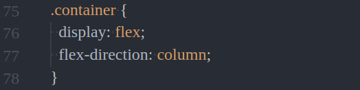

# footer 使用說明

## 以結果頁為例，步驟如下:

### 1.在 template 中增加 `<footer-component></footer-component>`

template 的 HTML 結構如下:

```
<template>
<div class="container">
<div class="header"></div>
<div class="content"></div>
<footer-component></footer-component>  
</div>
</template>
```

如下圖:


### 2.在 script 中增加

```
import footerComponent from "./Footer";
```

如下圖:


### 3.在 export dafault 的 components 中加入 footer component

```
  components: {
    footerComponent
  },
```

如下圖:


## 修改 container 的 SCSS


在 style 中的 .container 加上 display: flex; 與 flex-direction: column;

```
.container {
  height: 100%;
  display: flex;
  flex-direction: column;
}
```

如下圖:




接著在 .content 中加入 flex: 1 0 auto;

```
.content {
  flex: 1 0 auto;
}
```

如下圖:


---

補充說明：
這部份我已經替大家完成了不用跟著做，須替 html, body, #app 加上 height: 100%; 的樣式，才能讓 footer 定位在頁面底部
， 我是加 scss 資料夾裡的 setting.css 裡，

```
html,
body,
#app {
  height: 100%;
}
```
如下圖:


setting.css 在 main.js 中用 require 的方式載入

```
require("./scss/reset.css");
```

如下圖:


另外在 footer 的部份我已經加入
flex-shrink: 0;
就不用在自己加入了。

```
.footer{
  flex-shrink: 0;
}
```

如下圖:


---
參考資料


[Sticky Footer, Five Ways](https://css-tricks.com/couple-takes-sticky-footer/)


