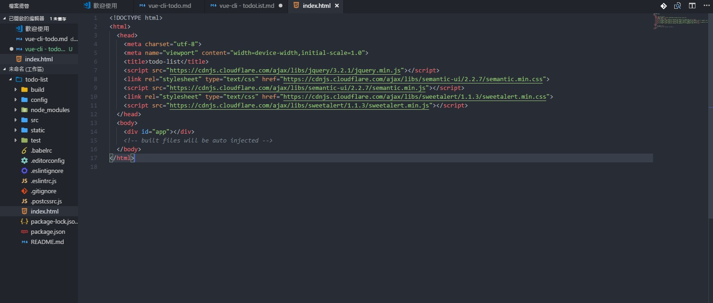
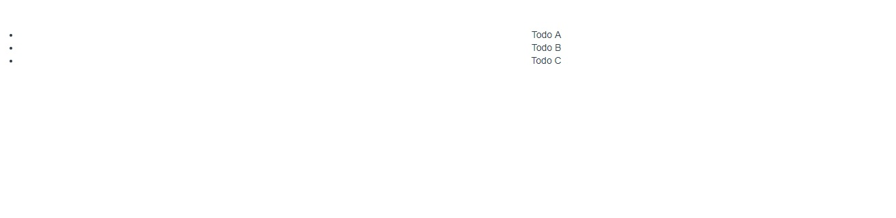

# Vue CLI - todoList 說明


### 載入樣式框架
我們使用 Semantic 這個 CSS 框架它提供了許多好看的元件讓我們可以使用許多現有樣式，與 Sweetalert 這個提示窗美化函示庫，
要使用這些框架與函式庫，我們就必須 在根目錄的 index.html 檔案中的 <head> 標籤裡透過 CDN 的方式載入它們的 source code.


```
<!-- ./index.html -->
<head>
  <meta charset="utf-8">
  <title>todo-app</title>
  <script src="https://cdnjs.cloudflare.com/ajax/libs/jquery/3.2.1/jquery.min.js"></script>
  <link rel="stylesheet" type="text/css" href="https://cdnjs.cloudflare.com/ajax/libs/semantic-ui/2.2.7/semantic.min.css">
  <script src="https://cdnjs.cloudflare.com/ajax/libs/semantic-ui/2.2.7/semantic.min.js"></script>
  <link rel="stylesheet" type="text/css" href="https://cdnjs.cloudflare.com/ajax/libs/sweetalert/1.1.3/sweetalert.min.css">
  <script src="https://cdnjs.cloudflare.com/ajax/libs/sweetalert/1.1.3/sweetalert.min.js"></script>
</head>
```

目前的 index.html 內容會是長這樣子:



我們需要而外安裝 sweetAlert 套件

```
npm install sweetalert --save
```

安裝完成後 import sweetalert
```
<template>
  <div id="app">
    <todo-list v-bind:todos="todos"></todo-list>
  </div>
</template>

<script>
// 移除匯入 HelloWord 組件
//import HelloWorld from './components/HelloWorld';

//匯入 TodoList 組件
import TodoList from './components/TodoList';

// 匯入 sweetalert

import sweetalert from 'sweetalert';


export default {
  name: 'App',
  components: {
    //移除
    //HelloWorld,
    //增加 TodoList
    TodoList,
  },

};
</script>

<style>
#app {
  font-family: 'Avenir', Helvetica, Arial, sans-serif;
  -webkit-font-smoothing: antialiased;
  -moz-osx-font-smoothing: grayscale;
  text-align: center;
  color: #2c3e50;
  margin-top: 60px;
}
</style>
```
---

### 組件結構

Vue Cli 是將 App.vue 作為一個父(根)組件，我們將會在 App 這個父組件裡新增 TodoList 子組件，在 TodoList 子組件裡還會有自己的子組件 Todo 與 CreateTodo。

---

### 新增 TodoList 組件

在資料夾 src 裡的 components 資料裡新增 TodoList.vue 檔案，每個 .vue 檔都可視為一個組件，由 template 、 script 、 style 這三個部分組成，分別是 HTML 、 JavaScript 、 CSS 程式碼撰寫的位子，每個組件都可以有自己的 HTML(DOM結構) 、 JavaScript(行為) 、 CSS(樣式) 。

TodoList 組件的程式碼如下:

```
<template>
  <div>
    <ul>
        <li> Todo A </li> 
        <li> Todo B </li> 
        <li> Todo C </li> 
    </ul> 
  </div>
</template>

<script type = "text/javascript" >

export default {
};
</script>
<style>
</style>
```


---

### 匯入組件

回到 App.vue 檔案中，先移除預設匯入的 HelloWorld 組件，
再將 TodoList 組件 匯入，
最後在 template 中，將 todoList 組件使用下劃線分隔的標籤加入，
主要是 template 不接受駝峰式命名(區分大小寫英文)。

```
<template>
  <div id="app">
    <todo-list></todo-list>
  </div>
</template>

<script>
// 移除匯入 HelloWorld 組件
//import HelloWorld from './components/HelloWorld';

//匯入 TodoList 組件
import TodoList from './components/TodoList';


export default {
  name: 'App',
  components: {
    //移除
    //HelloWorld,
    //增加 TodoList
    TodoList,
  },
};
</script>

<style>
#app {
  font-family: 'Avenir', Helvetica, Arial, sans-serif;
  -webkit-font-smoothing: antialiased;
  -moz-osx-font-smoothing: grayscale;
  text-align: center;
  color: #2c3e50;
  margin-top: 60px;
}
</style>

```

目前的網頁應該是長這樣子的



---

### 添加父組件數據

添加預設的代辦事項到父組件數據中，讓我們在開啟首頁時能看到幾筆預設的資料，代辦事項有三個屬性(標題、項目、完成狀況)，
增加預設代辦事項後的 App.vue 檔內容:

```
<template>
  <div id="app">
    <todo-list></todo-list>
  </div>
</template>

<script>
// 移除匯入 HelloWord 組件
//import HelloWorld from './components/HelloWorld';

//匯入 TodoList 組件
import TodoList from './components/TodoList';


export default {
  name: 'App',
  components: {
    //移除
    //HelloWorld,
    //增加 TodoList
    TodoList,
  },
  data() {
    return {
      //增加預設的代辦事項
      todos: [{
        title: 'Todo A',
        project: 'Project A',
        done: false,
      }, {
        title: 'Todo B',
        project: 'Project B',
        done: true,
      }, {
        title: 'Todo C',
        project: 'Project C',
        done: false,
      }, {
        title: 'Todo D',
        project: 'Project D',
        done: false,
      }],
    }
  }
};
</script>

<style>
#app {
  font-family: 'Avenir', Helvetica, Arial, sans-serif;
  -webkit-font-smoothing: antialiased;
  -moz-osx-font-smoothing: grayscale;
  text-align: center;
  color: #2c3e50;
  margin-top: 60px;
}
</style>

```

---

### 將父組件的數據與子組件 props 綁定

使用 v-bind 將原來 App.vue 檔案中的數據(預設的代辦事項)與子組件用來接收父組件數據的屬性 props 綁定，

App.vue 的 template 中的 `<todo-list></todo-list>` 修改成以下:

```
<template>
  <div id="app">
    <todo-list v-bind:todos="todos"></todo-list>
  </div>
</template>
```

---

### 傳遞數據給子組件接收

在 TodoList 子組件 的 部分增加 props， 目前程式碼會是長這樣子。

```
<template>
  <div>
    <ul>
      <li> Todo A </li>
      <li> Todo B </li>
      <li> Todo C </li>
    </ul>
  </div>
</template>

<script>
export default {
  props: ['todos'],
}
</script>

<style>

</style>


```

---

### 循環和渲染數據

在我們的 TodoList 模板中，可以循環顯示 todos 列表，並顯示已完成和未完成任務的數量。為了呈現項目列表，我們使用v-for指令。這樣做的語法表示為： v-for="item in items" 其中 items 是數據的陣列，item 是被迭代的陣列元素，
須注意 2.2.0 版後 v-for 需要搭配 v-bind:key="item.id"  與 key 綁定。

補充說明:

[v-for列表渲染](https://cn.vuejs.org/v2/guide/list.html)

TodoList 的 template 目前的程式碼如下:
```
<template>
<div>
    // JavaScript expressions in Vue are enclosed in double curly brackets.
    <p>Completed Tasks: {{todos.filter(todo => {return todo.done === true}).length}}</p>
    <p>Pending Tasks: {{todos.filter(todo => {return todo.done === false}).length}}</p>
    <div class='ui centered card' v-for="todo in todos" :key="todo.id">
      <div class='content'>
        <div class='header'>
          {{ todo.title }}
        </div>
        <div class='meta'>
          {{ todo.project }}
        </div>
        <div class='extra content'>
          <span class='right floated edit icon'>
            <i class='edit icon'></i>
          </span>
        </div>
      </div>
      <div class='ui bottom attached green basic button' v-show="todo.done">
        Completed
      </div>
      <div class='ui bottom attached red basic button' v-show="!todo.done">
        Complete
      </div>
  </div>
</template>
```

---

### 新增 Todo 組件

現在我們要將 原來 TodoList 組件中的待辦事項在拆解出來放到新的 Todo 子組件，
我們將代辦事項轉移到 Todo 組件，可利於我們擁有更清晰的程式碼，在編寫與維護時也可以更聚焦在一個功能上，

Todo 組件的程式碼如下:

```
<template>
  <div class='ui centered card'>
    <div class='content'>
        <div class='header'>
            {{ todo.title }}
        </div>
        <div class='meta'>
            {{ todo.project }}
        </div>
        <div class='extra content'>
            <span class='right floated edit icon'>
            <i class='edit icon'></i>
          </span>
        </div>
    </div>
    <div class='ui bottom attached green basic button' v-show="todo.done">
        Completed
    </div>
    <div class='ui bottom attached red basic button' v-show="!todo.done">
        Complete
    </div>
</div>
</template>

<script type="text/javascript">
  export default {
    props: ['todo'],
  };
</script>
```

將原來 TodoList 中的代辦事項程式碼搬移到 Todo 組件後，要將 Todo 組件插入到 TodoList 組件中，
並在這個組件中的輸出程式碼中加將 Todo 組件加入 components 中。
這邊的 filter 是陣列的內建方法，可以幫我們篩選符合條件的內容，這邊使用箭頭函式來回傳符合條件的項目，
並使用length 常獲取符合條件的陣列內容長度。

現在 TodoList 組件的程式碼如下:

```
<template>
<div>
    // JavaScript expressions in Vue are enclosed in double curly brackets.
    <p>Completed Tasks: {{todos.filter(todo => {return todo.done === true}).length}}</p>
    <p>Pending Tasks: {{todos.filter(todo => {return todo.done === false}).length}}</p>
    <todo v-for="todo in todos" :todo="todo" :key="todo.id"></todo>
  </div>
</template>

<script>
export default {
  props: ['todos'],
  components: {
    Todo,
  },
}
</script>

<style>

</style>
```


我們將在 Todo 組件中增加編輯待辦事項的方法與顯示條件，
我們透過 isEditing屬性是 true 還是 false ，
編輯待辦事項的方法透過 v-on:click 來觸發 showForm 顯示編輯表單的發法，
透過 hideForm 方法 來關閉編輯表單。
當 isEditing 的屬性是 true 時編輯表單顯示，反之則隱藏。
並分別在 mothods 加入 showForm  與 hideForm 方法。

補充說明:

[v-on事件處理器](https://cn.vuejs.org/v2/guide/events.html)

[v-show條件渲染](https://cn.vuejs.org/v2/guide/conditional.html#v-show)


現在 Todo 組件的程式碼如下:

```
<template>
<div class='ui centered card'>
    // Todo shown when we are not in editing mode.
    <div class="content" v-show="!isEditing">
      <div class='header'>
          {{ todo.title }}
      </div>
      <div class='meta'>
          {{ todo.project }}
      </div>
      <div class='extra content'>
          <span class='right floated edit icon' v-on:click="showForm">
          <i class='edit icon'></i>
        </span>
      </div>
    </div>
    // form is visible when we are in editing mode
    <div class="content" v-show="isEditing">
      <div class='ui form'>
        <div class='field'>
          <label>Title</label>
          <input type='text' v-model="todo.title" >
        </div>
        <div class='field'>
          <label>Project</label>
          <input type='text' v-model="todo.project" >
        </div>
        <div class='ui two button attached buttons'>
          <button class='ui basic blue button' v-on:click="hideForm">
            Close X
          </button>
        </div>
      </div>
    </div>
    <div class='ui bottom attached green basic button' v-show="!isEditing &&todo.done" disabled>
        Completed
    </div>
    <div class='ui bottom attached red basic button' v-show="!isEditing && !todo.done">
        Pending
    </div>
  </div>
</template>

<script type="text/javascript">
  export default {
     props: ['todo'],
    data() {
      return {
        isEditing: false,
      };
    },
    methods: {
      showForm() {
        this.isEditing = true;
      },
      hideForm() {
        this.isEditing = false;
      },
    },
  };
</script>
```

我們使用 v-model 將代辦事項中標題與內容的值與 Vue 實例數據的屬性綁定，所以一但編輯完待辦事項隨即可以看到編輯後的內容。

---

### 刪除代辦事項

在 Todo 組件中新增刪除事項的 Icon，
我們同又透過 v-on:click 來觸發刪除待辦事項的 deleteTodo 方法，
並在 mothods 中新增 deleteTodo 方法，
當刪除待辦事項的 deleteTodo 方法被觸發時，
我們透過 $emit 來向父組件發出一個事件，並傳遞預刪除的這筆待辦事項給父組件，

須注意: $emit 的 事件名稱到時須與 父組件監聽的事件名稱相同，
所以到時候父組件(TodoList) 的 v-on 點擊事件 會是這個樣子  v-on:子組件的事件名稱 

新增後 Todo 的 template 如下:

```
<template>
<div class='ui centered card'>
    // Todo shown when we are not in editing mode.
    <div class="content" v-show="!isEditing">
      <div class='header'>
          {{ todo.title }}
      </div>
      <div class='meta'>
          {{ todo.project }}
      </div>
      <div class='extra content'>
          <span class='right floated edit icon' v-on:click="showForm">
          <i class='edit icon'></i>
        </span>
        <!-- 增加刪除Icon -->
        <span class='right floated trash icon' v-on:click="deleteTodo(todo)">
          <i class='trash icon'></i>
        </span>
      </div>
    </div>
    // form is visible when we are in editing mode
    <div class="content" v-show="isEditing">
      <div class='ui form'>
        <div class='field'>
          <label>Title</label>
          <input type='text' v-model="todo.title" >
        </div>
        <div class='field'>
          <label>Project</label>
          <input type='text' v-model="todo.project" >
        </div>
        <div class='ui two button attached buttons'>
          <button class='ui basic blue button' v-on:click="hideForm">
            Close X
          </button>
        </div>
      </div>
    </div>
    <div class='ui bottom attached green basic button' v-show="!isEditing &&todo.done" disabled>
        Completed
    </div>
    <div class='ui bottom attached red basic button' v-show="!isEditing && !todo.done">
        Pending
    </div>
  </div>
</template>

<script type="text/javascript">
  export default {
    props: ['todo'],
    // Todo component
    methods: {
      deleteTodo(todo) {
        this.$emit('delete-todo', todo);
      },
    },
  };
</script>
```

TodoList 父組件中 mothods 需要增加 deleteTodo 方法用以刪除待辦事項

```
<template>
<div>
    <!-- JavaScript expressions in Vue are enclosed in double curly brackets. -->
    <p>Completed Tasks: {{todos.filter(todo => {return todo.done === true}).length}}</p>
    <p>Pending Tasks: {{todos.filter(todo => {return todo.done === false}).length}}</p>
    <!-- 注意 這邊的 v-on 事件監聽名稱需與 todo 子組件中 $emit 的事件名稱相同以接收待辦事項   -->
    <!-- 監聽點擊事件，觸發 deleteTodo 方法以刪除待辦事項 -->
    <todo v-for="todo in todos" :todo="todo" :key="todo.id" v-on:delete-todo="deleteTodo"></todo>
  </div>
</template>

<script>
export default {
  props: ['todos'],
  components: {
    Todo,
  },
  //增加 deleteTodo 方法
  methods: {
    deleteTodo(todo) {
      const todoIndex = this.todos.indexOf(todo);
      this.todos.splice(todoIndex, 1);
    }

  },
}
</script>

<style>

</style>


```
補充說明:

[事件向上傳遞](https://cn.vuejs.org/v2/guide/components.html#%E7%BB%84%E4%BB%B6%E7%BB%84%E5%90%88)

---


### 新增代辦事項

在 src/compontnts 資料夾中新增 CreateTodo.vue 檔案，
我們要新增一個按鈕用以新增預增加的待辦事項，
點擊後會出現新增的表單得以新增標題及待辦內容，

在 CreateTodo 的 data 中 新增 isCreating，
當 isCreating 的屬性值是 true 時，打開新增待辦事項的表單，
反之隱藏，

methods 中的 openForm 方法用來打開新增待辦事項的表單，
methods 中的 closeForm 方法用來隱藏新增待辦事項的表單，
methods 中的 sentForm 方法是用來將預新增的代辦事項給根組件 (App.vue)，
代辦事項預設為完成，
同樣通過 $emit 發出一個 create-todo 事件，來讓根組件接收，


CreateTodo 組件程式碼如下:
```
<template>
  <div class='ui basic content center aligned segment'>
    <button class='ui basic button icon' v-on:click="openForm" v-show="!isCreating">
      <i class='plus icon'></i>
    </button>
    <div class='ui centered card' v-show="isCreating">
      <div class='content'>
        <div class='ui form'>
          <div class='field'>
            <label>Title</label>
            <input v-model="titleText" type='text' ref='title' defaultValue="">
          </div>
          <div class='field'>
            <label>Project</label>
            <input type='text' ref='project' defaultValue="">
          </div>
          <div class='ui two button attached buttons'>
            <button class='ui basic blue button' v-on:click="sendForm()">
              Create
            </button>
            <button class='ui basic red button' v-on:click="closeForm">
              Cancel
            </button>
          </div>
        </div>
      </div>
    </div>
  </div>
</template>

<script>
export default {
  data() {
    return {
      titleText: '',
      projectText: '',
      isCreating: false,
    };
  },
  methods: {
    openForm() {
      this.isCreating = true;
    },
    closeForm() {
      this.isCreating = false;
    },
    sendForm() {
      if (this.titleText.length > 0 && this.projectText.length > 0) {
        const title = this.titleText;
        const project = this.projectText;
        this.$emit('create-todo', {
          title,
          project,
          done: false,
        });
        this.newTodoText = '';
      }
      this.isCreating = false;
    },
  },
};
</script>
```

CreateTodo 組件新增完內容後需要匯入到 App 根組件


App.vue 現在的程式碼如下:
```
<template>
  <div id="app">
    <todo-list v-bind:todos="todos"></todo-list>
  </div>
</template>

<script>
// 移除匯入 HelloWord 組件
//import HelloWorld from './components/HelloWorld';

//匯入 TodoList 組件
import TodoList from './components/TodoList';

// 匯入 sweetalert

import sweetalert from 'sweetalert';

// 匯入 CreateTdo 組件

import CreateTodo from './components/CreateTodo';


export default {
  name: 'App',
  components: {
    //移除
    //HelloWorld,
    //增加 TodoList
    TodoList,
    //增加 CreateTodo
    CreateTodo,
  },
  data() {
    return {
      //增加預設的代辦事項
      todos: [{
        title: 'Todo A',
        project: 'Project A',
        done: false,
      }, {
        title: 'Todo B',
        project: 'Project B',
        done: true,
      }, {
        title: 'Todo C',
        project: 'Project C',
        done: false,
      }, {
        title: 'Todo D',
        project: 'Project D',
        done: false,
      }],
    }
  }
};
</script>

<style>
#app {
  font-family: 'Avenir', Helvetica, Arial, sans-serif;
  -webkit-font-smoothing: antialiased;
  -moz-osx-font-smoothing: grayscale;
  text-align: center;
  color: #2c3e50;
  margin-top: 60px;
}
</style>

```

接著我們在 App 根組件 的 template 加入 CreateTodo 子組件，與在
methods中加入新增待辦事項的方法，

注意: create-todo 標籤中 v-on的監聽事件名稱需與 CreateTodo 子組件 $emit 發出的事件名稱相同以接收事件及預新增的代辦事項參數


App 根組件程式碼如下:

```
<template>
  <div id="app">
    <todo-list v-bind:todos="todos"></todo-list>
    <create-todo v-on:create-todo="addTodo"></create-todo>
  </div>
</template>

<script>
// 移除匯入 HelloWord 組件
//import HelloWorld from './components/HelloWorld';

//匯入 TodoList 組件
import TodoList from './components/TodoList';

// 匯入 sweetalert

import sweetalert from 'sweetalert';

// 匯入 CreateTdo 組件

import CreateTodo from './components/CreateTodo';


export default {
  name: 'App',
  components: {
    //移除
    //HelloWorld,
    //增加 TodoList
    TodoList,
    //增加 CreateTodo
    CreateTodo,
  },
  data() {
    return {
      //增加預設的代辦事項
      todos: [{
        title: 'Todo A',
        project: 'Project A',
        done: false,
      }, {
        title: 'Todo B',
        project: 'Project B',
        done: true,
      }, {
        title: 'Todo C',
        project: 'Project C',
        done: false,
      }, {
        title: 'Todo D',
        project: 'Project D',
        done: false,
      }],
    }
  },
  methods: {
    addTodo(newTodo) {
      this.todos.push(newTodo);
    }
  }
};
</script>

<style>
#app {
  font-family: 'Avenir', Helvetica, Arial, sans-serif;
  -webkit-font-smoothing: antialiased;
  -moz-osx-font-smoothing: grayscale;
  text-align: center;
  color: #2c3e50;
  margin-top: 60px;
}
</style>

```

### 完成待辦事項

在 Todo 組件的 template 中 Pending 的 div 新增 v-on:click 來觸發 completeTodo 方法，
並在 methods 中新增 completeTodo 方法以向父組件發出 complete-todo 事件，來傳遞代辦事項的內容參數，

Todo 組件程式碼如下:
```
<template>
<div class='ui centered card'>
    // Todo shown when we are not in editing mode.
    <div class="content" v-show="!isEditing">
      <div class='header'>
          {{ todo.title }}
      </div>
      <div class='meta'>
          {{ todo.project }}
      </div>
      <div class='extra content'>
          <span class='right floated edit icon' v-on:click="showForm">
          <i class='edit icon'></i>
        </span>
        <!-- 增加刪除Icon -->
        <span class='right floated trash icon' v-on:click="deleteTodo(todo)">
          <i class='trash icon'></i>
        </span>
      </div>
    </div>
    // form is visible when we are in editing mode
    <div class="content" v-show="isEditing">
      <div class='ui form'>
        <div class='field'>
          <label>Title</label>
          <input type='text' v-model="todo.title" >
        </div>
        <div class='field'>
          <label>Project</label>
          <input type='text' v-model="todo.project" >
        </div>
        <div class='ui two button attached buttons'>
          <button class='ui basic blue button' v-on:click="hideForm">
            Close X
          </button>
        </div>
      </div>
    </div>
    <div class='ui bottom attached green basic button' v-show="!isEditing &&todo.done" disabled>
        Completed
    </div>
    <div class='ui bottom attached red basic button' v-on:click="completeTodo(todo)" v-show="!isEditing && !todo.done">
        Pending
    </div>
  </div>
</template>

<script type="text/javascript">
  export default {
    props: ['todo'],
    // Todo component
    methods: {
      completeTodo(todo) {
        this.$emit('complete-todo', todo);
      },
      deleteTodo(todo){
        this.$emit('delete-todo', todo);
      }
    },
  };
</script>
```


TodoList 父組件需要增加 v-on:子組件觸發的事件名稱，

在 TodoList 組件 template 中 新增 v-on:子組件發出的 complete-todo 事件，以接預新增收待辦事項內容參數與觸法的方法來完成待辦事項，
在 TodoList 組件中 mothods 裡新增 completeTodo 用以完成待辦事項，

TodoList 父組件程式碼如下:

```
<template>
<div>
    <!-- JavaScript expressions in Vue are enclosed in double curly brackets. -->
    <p>Completed Tasks: {{todos.filter(todo => {return todo.done === true}).length}}</p>
    <p>Pending Tasks: {{todos.filter(todo => {return todo.done === false}).length}}</p>
    <!-- 注意 這邊的 v-on 事件監聽名稱需與子組件中 $emit 的事件名稱相同以接收待辦事項   -->
    <todo v-for="todo in todos" :todo="todo" :key="todo.id" v-on:delete-todo="deleteTodo" v-on:complete-todo="completeTodo"></todo>
  </div>
</template>

<script>
export default {
  props: ['todos'],
  components: {
    Todo,
  },
  //監聽點擊事件，觸發 deleteTodo 方法以刪除待辦事項
  methods: {
    completeTodo(todo) {
      const todoIndex = this.todos.indexOf(todo);
      this.todos[todoIndex].done = true;
    },
    deleteTodo(todo) {
      const todoIndex = this.todos.indexOf(todo);
      this.todos.splice(todoIndex, 1);
    }

  },
}
</script>

<style>

</style>


```

這樣我們的 TodoList 就告一個段落了!


