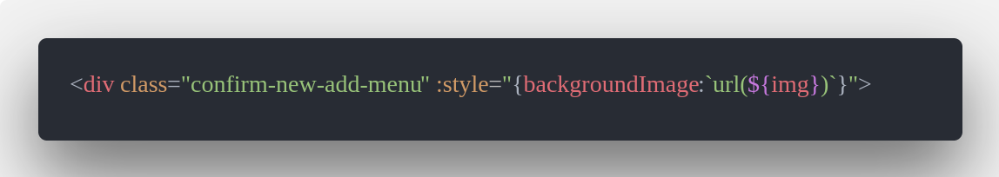
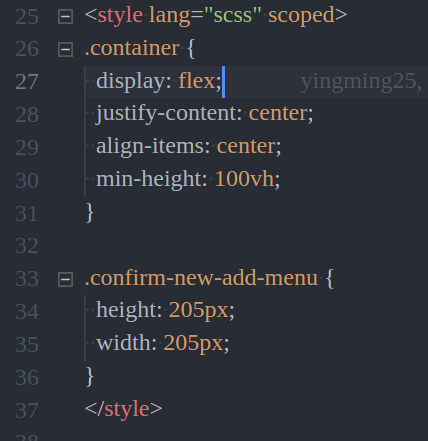
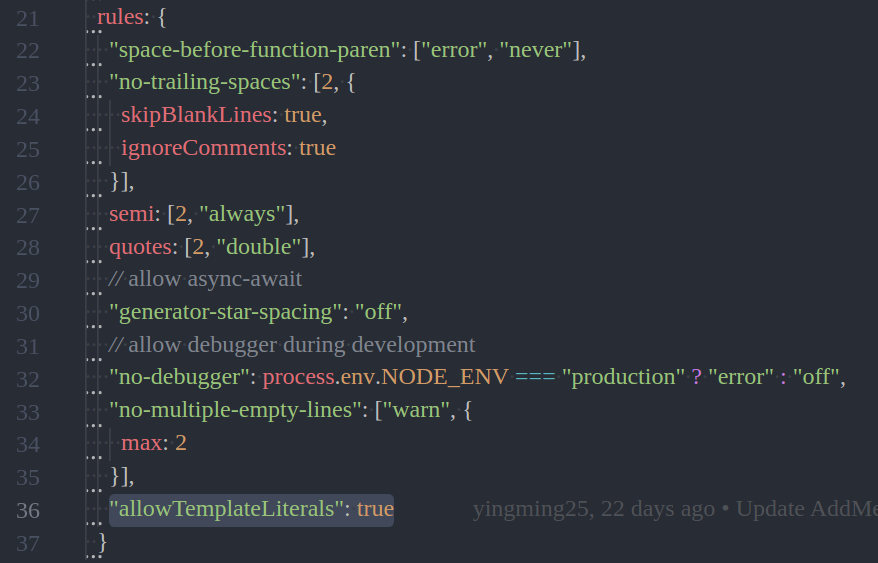

# background-image 無法顯示

遇到的問題：
使用 background-image 背景圖方式載入的圖片無法顯示
---
解決方法：

使用 v-bind 將行內樣式 style 與 Vue data 中 require 近來的圖片路徑屬性 img (名稱可以自己取 ex: images)綁定，

※圖片路徑視自己的檔名會有所不同

```
<div class="confirm-new-add-menu" :style="{backgroundImage:`url(${img})`}">
```




接下來給這個 div 的 class confirm-new-add-menu 固定的寬高以顯示圖片大小

```
.confirm-new-add-menu {
  height: 205px;
  width: 205px;
}
```



設定完寬高後圖片就能正常顯示了
如下圖：


補充說明：
如果有出現 ESlint 錯誤可能是沒有允許模板字符串，在 ESlint rule 中 加入

```
"allowTemplateLiterals": true
```




---
參考資料：

[vue的style绑定不支持background-image吗？](https://segmentfault.com/q/1010000005613040)

[background-image in style property, what is the best practice?](https://github.com/vuejs/vue-loader/issues/646)

