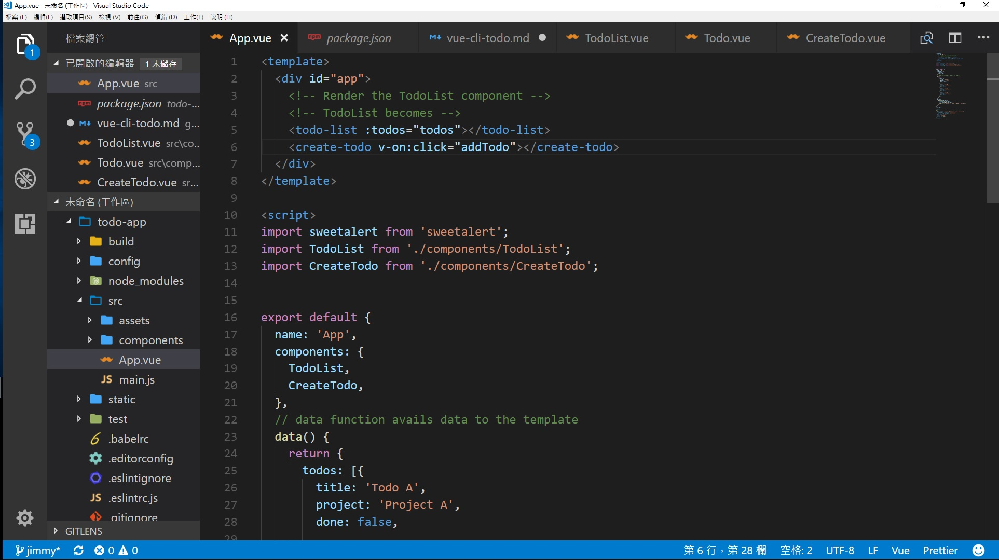
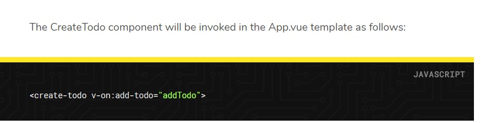
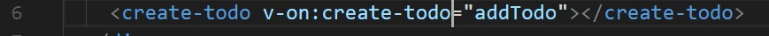

# Vue Cli TodoList 教學

[教學網址](https://scotch.io/tutorials/build-a-to-do-app-with-vue-js-2)

### 在實作這個教學範例時的發生問題

1. 教學的範例程式碼沒有將 CreateTodo components import 到 App.vue中
解決方法:
再 App.vue 中補上 import CreateTdo

2. 子組件觸發事件給父組件接收，教學範例事件名稱錯誤

範例中錯誤的語法:

應將父組件 v-on 自訂義事件名稱改成與子組件觸發的事件名稱相同來接收子組件傳來的參數

