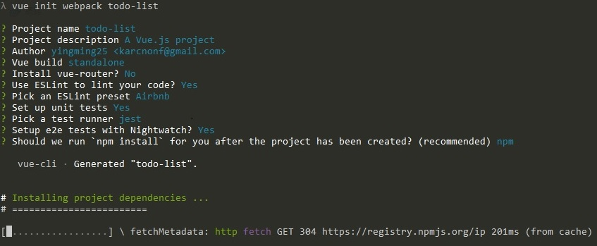
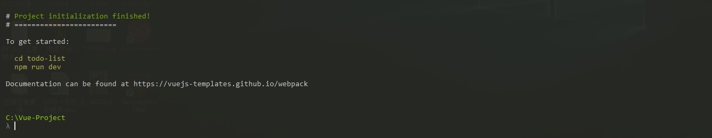
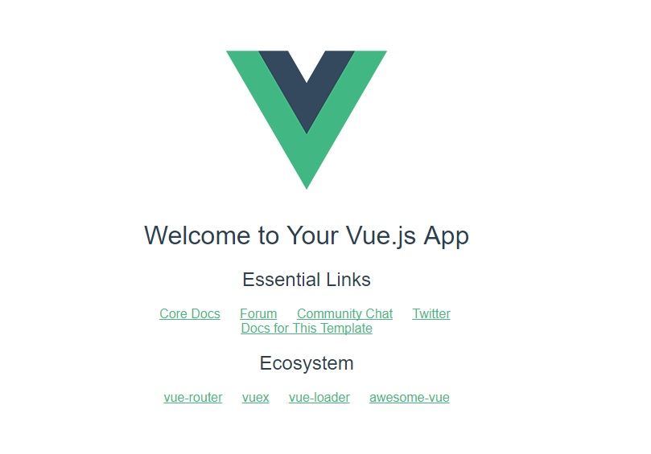

# 建立 Vue CLI 環境

### 安裝Vue CLI

我們將 vue-cli 安裝在全域環境。

```
npm install vue-cli -g
```


### 初始化樣板

Vue CLI 提供了許多樣板，在這個範例中我們選擇 webpack 樣板來產生檔案架構，   todo-list 則是專案名稱。

```
vue init webpack todo-list
```

依提示輸入樣板配置:



### 進入專案目錄並執行

模板初始化完成後，會出現如何開始的提示，
首先進入專案目錄:

```
cd todo-list
```

開啟開發環境:

```
npm run dev
```

執行後會立刻開啟瀏覽器並引導你到 http://localhost:8080 這個頁面，


指令行的畫面:

命令行監聽 http://localhost:8080 ，只要檔案一修改網頁即時更新



在瀏覽器上的畫面:




---

相關資源:

[Vue Cli教學影片](https://www.youtube.com/watch?v=3ypel9_VtmU)

[Vue Cli 介紹](https://paper.dropbox.com/doc/Vue-Cli-pbpJGPUyjZy5xuoSFffId)

[Vue Cli架構說明](https://juejin.im/entry/585a6ef561ff4b00687f91f8)

