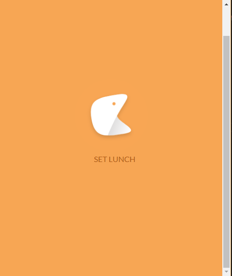

### 首次 Loading 頁面 建置

- 顯示畫面

用flexbox的方式將LOGO、文字置中
```html

<div class="flex-container">
  <div class="flex-item">
   
   <p class="home-text">SET LUNCH</p>
  </div>
</div>

<style>
.flex-container {
 display: -webkit-flex;
    display: flex;
    height: 637px;
    background-color: #f7a654;
          
}
.flex-item {
margin: auto;
}
.home-text{
     margin-left:40px; 
     color:#b15814;
     font-size: 16px;
}


.home-logo{
     height:150px;
     width:150px;
}

</style>

```

顯示畫面如下:

  

- 一秒跳轉google

``` javaScript

setTimeout( "location.href='http://google.com'", 1000 )

```