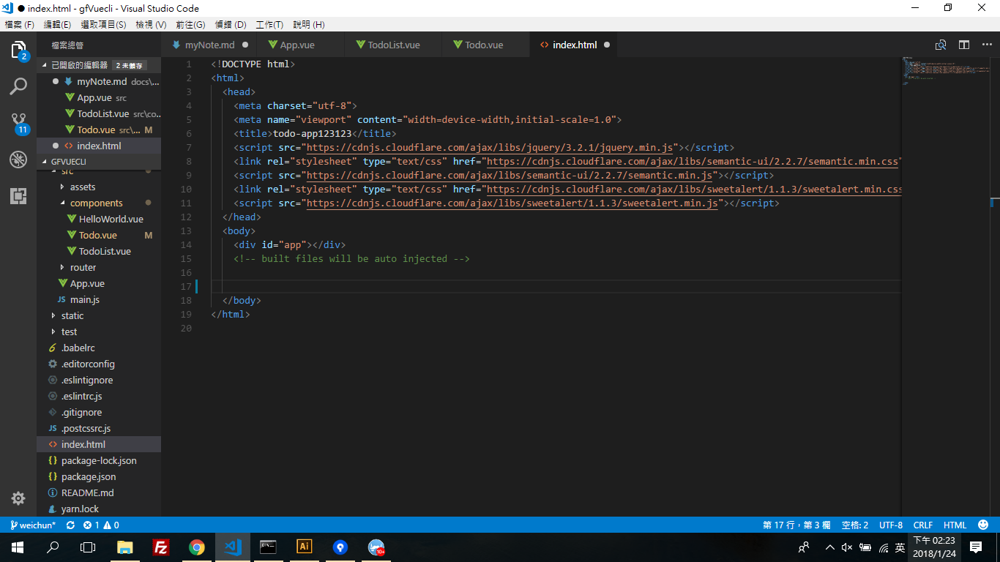
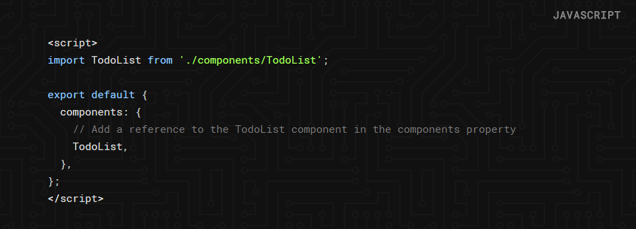
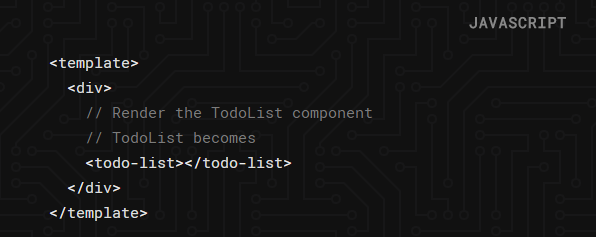
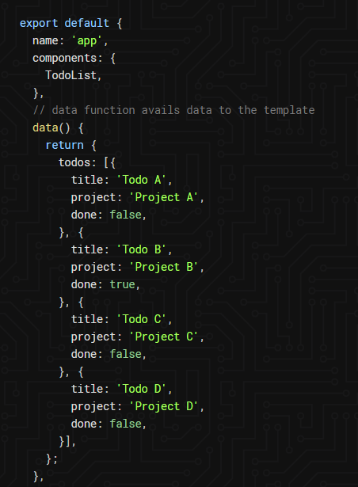
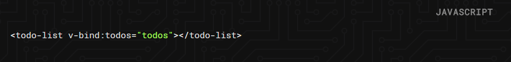
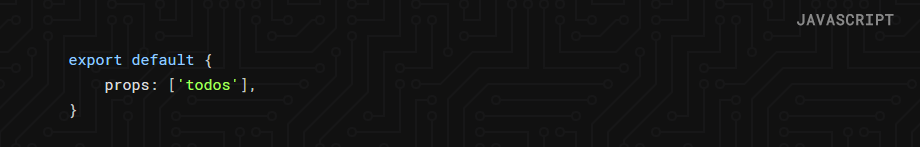

## vue cli-weichun 的 紀錄

### 2018/1/23 vue-cli TO DO LIST 練習紀錄 

***

#### vue cli 環境架設

0. 需先下載 node.js 9.4.0

1. 從github/monospaceTW/goodfood 的 develop 裡面 clone 到自己的local端(在本地端建立了一個vuecli資料夾)，建立branch:weichun並push上去，完成自己的 遠端及本地端 branch。

2. 打開node.js command prompt 執行npm下載
- cd gfVuecli 進入本地端 branch的資料夾
- npm install 下載npm
- 完成下載後，便可以在 http://localhost:8080 看到 vue cli 預設hello world 畫面
- 出現歡迎畫面便完成初步環境建置。 

#### TO DO LIST 練習

0. 環境建置  
參考網站:[Jeremy Kithome 的文章](https://scotch.io/tutorials/build-a-to-do-app-with-vue-js-2) ; 
使用樣式 [semantic](https://semantic-ui.com/) 及 [sweetalert](https://sweetalert.js.org/)


1. 將 [semantic](https://semantic-ui.com/) 及 [sweetalert](https://sweetalert.js.org/) 放入index裡，才會有如[DEMO](https://todo-vue.herokuapp.com/)的樣式。




2. Vue cli架構:

- Component structure- a main component & sub-components. <br>
VUE CLI 的架構為:主架構+子架構


(此範例中: App.vue為main component;TodoList.vue、Todo.vue為sub-components)

- 建立一個新的vue檔案-TodoList.vue 此新檔案裏面包含三個部分:template(visual part), component class(行為、事件、DATA在此區域) and styles sections.


3. Importing Components-將TodoList.vue import到 App.vue

- 用 TodoList.vue 取代 HelloWorld.vue:


  a. 在components資料夾中開啟App.vue


  b. script處 import 由 HellowWorld 改為 TodoList


  
  


  c. template 用 ```<todo-list> </todo-list>```的方式選染(render)於檔案 TodoList.vue 寫的內容


  
  


  d. 完成import之後，則main-component-App.vue的頁面就會從原本預設helloWorld畫面轉為顯示sub-component-TodoList.vue的內容


4. Adding Component Data- 在App.vue 增加 todos表單的內容資料


- 須提供data給main-component，這個data會將todos的表單內容顯示。 


- todos表單內容(data)有三個部分: 標題(title)、專案(project)、完成(done 用來告知是否完成)




- 使用v-bind將data(todos表單)導向給TodoList.vue。



- 完成導向後，必須在TodoList.vue的component class處做出prop宣告使這個component(TodoList.vue)可以讀取data(todos表單):




5. Looping and Rendering Data- 迴圈 和 渲染 data(todos表單)

- 在TodoList.vue中，為了渲染todos表單裡面的items(Todo、project、complete/pending)，使用```v-for="item in items"```。

```html
<template>
  <div>
    // JavaScript expressions in Vue are enclosed in double curly brackets.
    <p>Completed Tasks: {{todos.filter(todo => {return todo.done === true}).length}}</p>
    <p>Pending Tasks: {{todos.filter(todo => {return todo.done === false}).length}}</p>
    <div class='ui centered card' v-for="todo in todos">
      <div class='content'>
        <div class='header'>
          {{ todo.title }}
        </div>
        <div class='meta'>
          {{ todo.project }}
        </div>
        <div class='extra content'>
          <span class='right floated edit icon'>
            <i class='edit icon'></i>
          </span>
        </div>
      </div>
      <div class='ui bottom attached green basic button' v-show="todo.done">
        Completed
      </div>
      <div class='ui bottom attached red basic button' v-show="!todo.done">
        Complete
      </div>
  </div>
</template>

<script type = "text/javascript" >

export default {
  props: ['todos'],
};
</script>
```


6. Editing a Todo- 編輯Todo.vue

- 為了使code更乾淨，在src/components處新增一個新的檔案:Todo.vue，並輸入內容:

```html
<template>
  <div class='ui centered card'>
    <div class='content'>
        <div class='header'>
            {{ todo.title }}
        </div>
        <div class='meta'>
            {{ todo.project }}
        </div>
        <div class='extra content'>
            <span class='right floated edit icon'>
            <i class='edit icon'></i>
          </span>
        </div>
    </div>
    <div class='ui bottom attached green basic button' v-show="todo.done">
        Completed
    </div>
    <div class='ui bottom attached red basic button' v-show="!todo.done">
        Complete
    </div>
</div>
</template>

<script type="text/javascript">
  export default {
    props: ['todo'],
  };
</script>
```

-  用```v-for``` 及 ```v-bind``` 與 ```props```將TodoList.vue pass給Todo.vue:

## 此為 TodoList.vue的code
```html

<template>
  <div>
    <p>Completed Tasks: {{todos.filter(todo => {return todo.done === true}).length}}</p>
    <p>Pending Tasks: {{todos.filter(todo => {return todo.done === false}).length}}</p>
   // we are now passing the data to the todo component to render the todo list
    <todo  v-for="todo in todos" v-bind:todo="todo"></todo> 
  </div>
</template>

<script type = "text/javascript" >

import Todo from './Todo';

export default {
  props: ['todos'],
  components: {
    Todo,
  },
};
</script>
```

- Let's add a property to the Todo component class called isEditing.

## 此為在 Todo.vue的code
```html

<template>
  <div class='ui centered card'>
    // Todo shown when we are not in editing mode.
    <div class="content" v-show="!isEditing">
      <div class='header'>
          {{ todo.title }}
      </div>
      <div class='meta'>
          {{ todo.project }}
      </div>
      <div class='extra content'>
          <span class='right floated edit icon' v-on:click="showForm">
          <i class='edit icon'></i>
        </span>
      </div>
    </div>
    // form is visible when we are in editing mode
    <div class="content" v-show="isEditing">
      <div class='ui form'>
        <div class='field'>
          <label>Title</label>
          <input type='text' v-model="todo.title" >
        </div>
        <div class='field'>
          <label>Project</label>
          <input type='text' v-model="todo.project" >
        </div>
        <div class='ui two button attached buttons'>
          <button class='ui basic blue button' v-on:click="hideForm">
            Close X
          </button>
        </div>
      </div>
    </div>
    <div class='ui bottom attached green basic button' v-show="!isEditing &&todo.done" disabled>
        Completed
    </div>
    <div class='ui bottom attached red basic button' v-show="!isEditing && !todo.done">
        Pending
    </div>
  </div>
</template>
```


- In addition to the showForm method we will need to add a hideForm method to close the form when the cancel button is clicked. Let's see what our script now looks like.

```html

<script>
export default {
  props: ['todo'],
  data() {
    return {
      isEditing: false,
    };
  },
  methods: {
    showForm() {
      this.isEditing = true;
    },
    hideForm() {
      this.isEditing = false;
    },
  },
};
</script>

```


7. Deleting a Todo
